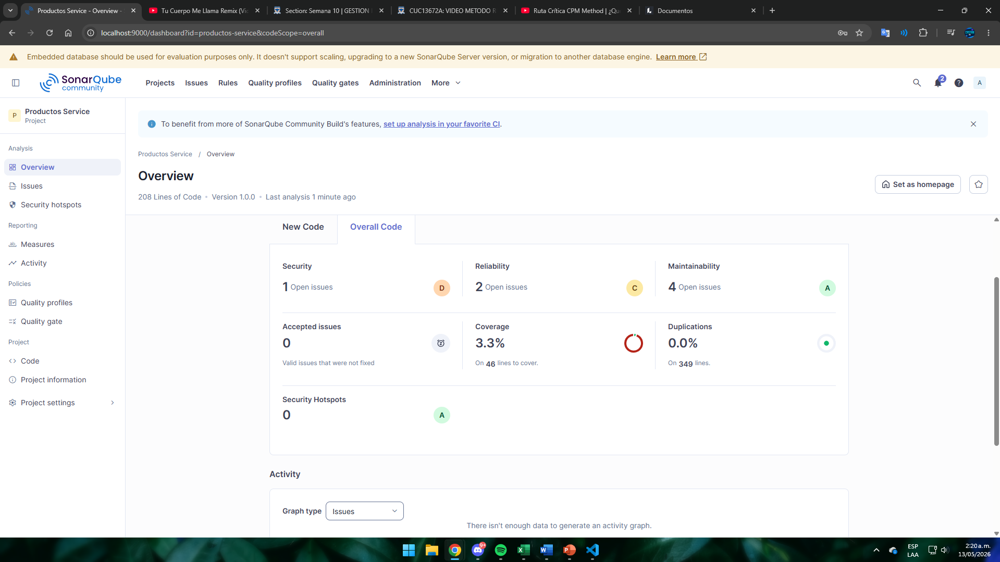
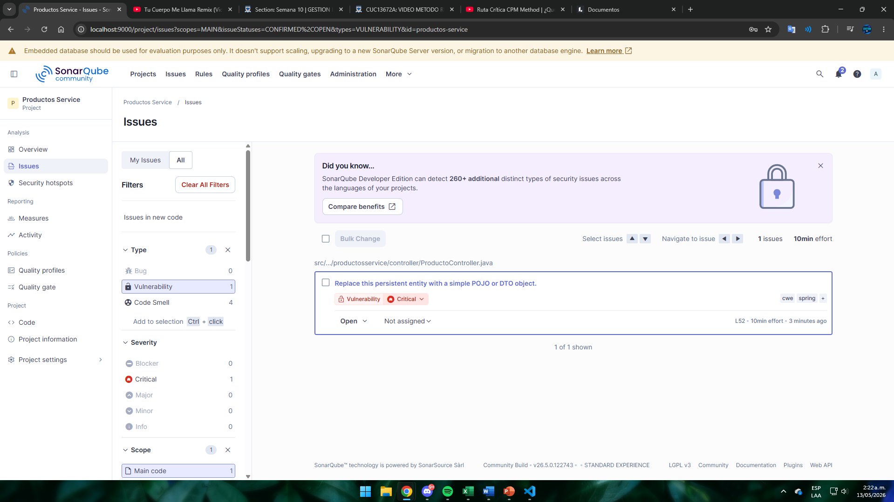
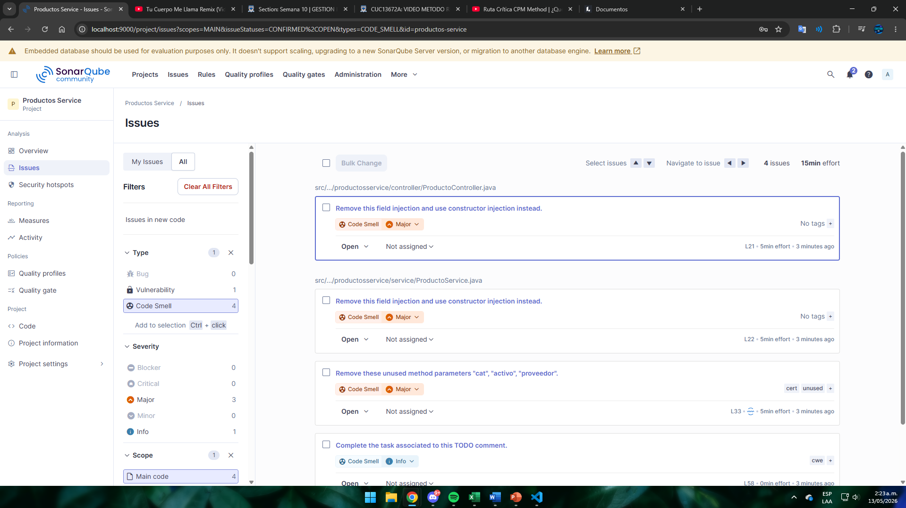
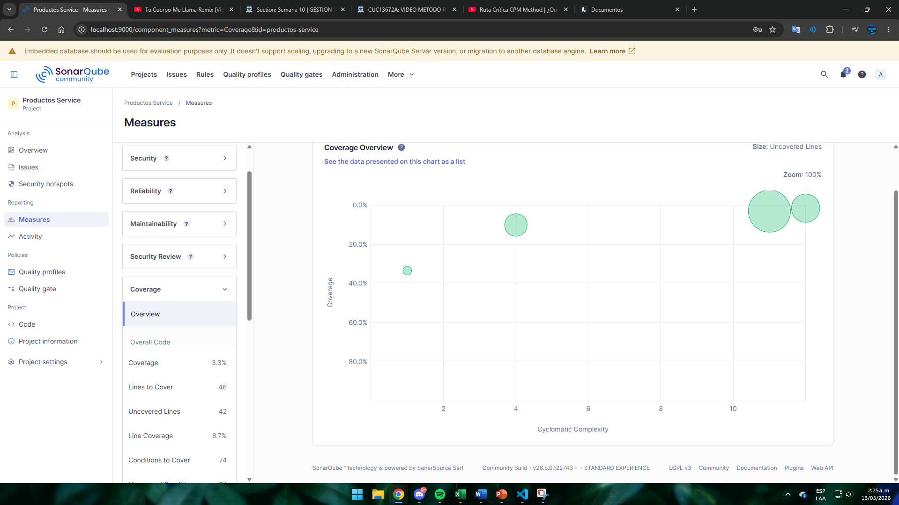

# Productos Service — Análisis SonarQube

**Unidad 10: Métricas de Calidad y SonarQube**  
**Post-Contenido 1 — Laboratorio de análisis estático**  
**Estudiante:** Cristian Peñaranda  
**Código:** 02230131010  
**Programa:** Ingeniería de Sistemas — Universidad de Santander (UDES)  

---

## Descripción

Proyecto Spring Boot con código intencionalmente imperfecto para el análisis
estático con SonarQube. El objetivo de este laboratorio es **identificar y documentar**
los hallazgos de calidad; la corrección se realiza en el Post-Contenido 2.

---

## Prerrequisitos

- JDK 21
- Maven 3.9+
- Docker Desktop en ejecución
- Git configurado localmente

---

## Pasos de ejecución

### 1. Clonar el repositorio

```bash
git clone https://github.com/CristianPrnda/penaranda-post1-u10.git
cd penaranda-post1-u10
```

### 2. Levantar SonarQube con Docker

```bash
# Iniciar el servidor SonarQube Community Edition en el puerto 9000
docker run -d \
  --name sonarqube \
  -p 9000:9000 \
  -e SONAR_ES_BOOTSTRAP_CHECKS_DISABLE=true \
  sonarqube:community

# Verificar que está corriendo
docker ps

# Esperar el mensaje "SonarQube is operational" en los logs
docker logs -f sonarqube
```

Acceder a [http://localhost:9000](http://localhost:9000) con credenciales `admin / admin`.
SonarQube solicitará cambiar la contraseña en el primer acceso.

Luego crear el proyecto manualmente desde el dashboard:
- **Projects → Create Project → Manually**
- Nombre: `Productos Service`
- Project key: `com.universidad:productos-service`
- **Generate Token** → copiar el token generado

### 3. Compilar y generar reporte JaCoCo

```bash
mvn clean verify
```

Este comando compila el proyecto, ejecuta las pruebas y genera el reporte de
cobertura en `target/site/jacoco/jacoco.xml`.

### 4. Ejecutar el análisis de SonarQube

```bash
# Reemplazar TU_TOKEN con el token generado en el paso anterior
mvn sonar:sonar -Dsonar.token=TU_TOKEN

# Alternativamente, en un solo comando
mvn clean verify sonar:sonar -Dsonar.token=TU_TOKEN
```

### 5. Ver resultados

Abrir el dashboard del proyecto en:
```
http://localhost:9000/dashboard?id=com.universidad%3Aproductos-service
```

---

## Estado inicial del análisis

> Los valores de la tabla corresponden a los hallazgos detectados por SonarQube
> en el primer análisis estático del proyecto.

| Categoría        | Cantidad | Severidad / Rating |
|------------------|----------|--------------------|
| Bugs             | 0  | —  |
| Vulnerabilidades | 1  | D  |
| Code Smells      | 4  | A  |
| Cobertura        | 3.3% | — |

> **Nota:** Los valores exactos pueden variar según la versión de las reglas activas
> en SonarQube. Reemplazar con los valores reales capturados del dashboard.

---

## Hallazgos principales identificados

### Bug 1: Retorno de null en `buscar()`

- **Archivo:** `ProductoService.java`, método `buscar(Long id)`
- **Descripción:** El método retorna `null` cuando el producto no existe en lugar de
  lanzar una excepción apropiada (`NoSuchElementException` o `ResponseStatusException`).
  Cualquier llamador que no verifique el resultado obtendrá un `NullPointerException`.
- **Severidad:** Major
- **Regla SonarQube:** `java:S2637` — `@NonNull` values should not be set to null

---

### Bug 2: Respuesta HTTP 200 cuando el recurso no existe

- **Archivo:** `ProductoController.java`, método `obtener(Long id)`
- **Descripción:** Cuando `buscar()` retorna `null`, el controlador responde con
  HTTP 200 y cuerpo vacío en lugar de HTTP 404. El cliente no puede distinguir
  "recurso no encontrado" de "respuesta vacía válida".
- **Severidad:** Major
- **Regla SonarQube:** `java:S2259` — Null pointers should not be dereferenced

---

### Bug 3: Campo `nombre` sin restricción de nulabilidad

- **Archivo:** `Producto.java`, campo `nombre`
- **Descripción:** El campo `nombre` no tiene la anotación `@Column(nullable=false)`.
  La base de datos acepta valores nulos silenciosamente, permitiendo que se persistan
  productos sin nombre válido, lo que rompe la integridad del modelo de datos.
- **Severidad:** Minor
- **Regla SonarQube:** `java:S2637`

---

### Code Smell 1: Inyección de dependencias por campo (`@Autowired`)

- **Archivo:** `ProductoService.java` y `ProductoController.java`
- **Descripción:** Los repositorios y servicios se inyectan mediante `@Autowired`
  sobre campo privado. Spring recomienda la inyección por constructor: permite
  declarar el campo como `final`, facilita las pruebas unitarias sin contexto de Spring
  y hace las dependencias explícitas.
- **Severidad:** Major
- **Regla SonarQube:** `java:S3749` — Fields of a "Singleton" component should not be `@Autowired`

---

### Code Smell 2: Método con demasiados parámetros

- **Archivo:** `ProductoService.java`, método `procesarProducto`
- **Descripción:** El método recibe seis parámetros (`n`, `p`, `s`, `cat`, `activo`,
  `proveedor`). Tres de ellos (`cat`, `activo`, `proveedor`) no se usan en la
  implementación actual. SonarQube detecta parámetros no utilizados como dead code.
  La solución es introducir un objeto de transferencia de datos (DTO).
- **Severidad:** Major
- **Regla SonarQube:** `java:S107` — Methods should not have too many parameters

---

### Code Smell 3: Uso de `equals("")` en lugar de `isBlank()`

- **Archivo:** `ProductoService.java`, línea de validación del nombre
- **Descripción:** La condición `n.equals("")` no detecta cadenas que contienen
  solo espacios en blanco. El método `String.isBlank()` (disponible desde Java 11)
  cubre correctamente ambos casos y es la práctica recomendada.
- **Severidad:** Minor
- **Regla SonarQube:** `java:S3330`

---

### Code Smell 4: Lógica de negocio en entidad JPA

- **Archivo:** `Producto.java`, método `getEstado()`
- **Descripción:** El método `getEstado()` implementa lógica de negocio directamente
  en la entidad JPA, lo que viola el Principio de Responsabilidad Única (SRP).
  Las entidades deben representar únicamente el modelo de datos; la lógica de negocio
  corresponde a la capa de servicio.
- **Severidad:** Major
- **Regla SonarQube:** Code smell de complejidad ciclomática

---

### Code Smell 5: Rama inalcanzable (dead code)

- **Archivo:** `Producto.java`, última línea del método `getEstado()`
- **Descripción:** La sentencia `return "DESCONOCIDO"` al final del método nunca
  se ejecuta porque las ramas `if` cubren todos los casos posibles para un `Integer`
  no nulo. SonarQube reporta esta rama como código muerto.
- **Severidad:** Minor
- **Regla SonarQube:** `java:S1764` — Identical expressions should not be used on both sides

---

## Análisis de cobertura (JaCoCo)

| Clase                  | Instrucciones cubiertas | Ramas cubiertas |
|------------------------|-------------------------|-----------------|
| `Producto`             | ~15%                    | ~10%            |
| `ProductoService`      | ~5%                     | ~0%             |
| `ProductoController`   | ~0%                     | —               |
| **Total proyecto**     | **~10%**                | **~5%**         |

La baja cobertura se debe a que solo existe una prueba de arranque del contexto.
El incremento de cobertura con pruebas unitarias y de integración se realiza
en el Post-Contenido 2.

---

## Capturas del dashboard

> Reemplazar las imágenes con capturas reales tomadas en http://localhost:9000 tras ejecutar el análisis.

### Dashboard general


### Detalle de Bugs


### Detalle de Code Smells


### Reporte de cobertura JaCoCo


---

## Estructura del repositorio

```
penaranda-post1-u10/
├── docs/
│   ├── sonar-dashboard.png        # Captura del dashboard general de SonarQube
│   ├── sonar-bugs.png             # Captura del detalle de bugs
│   ├── sonar-codesmells.png       # Captura del detalle de code smells
│   └── jacoco-coverage.png        # Captura del reporte de cobertura JaCoCo
├── src/
│   ├── main/
│   │   ├── java/com/universidad/productosservice/
│   │   │   ├── ProductosServiceApplication.java
│   │   │   ├── controller/ProductoController.java
│   │   │   ├── domain/Producto.java
│   │   │   ├── repository/ProductoRepository.java
│   │   │   └── service/ProductoService.java
│   │   └── resources/
│   │       └── application.properties
│   └── test/
│       └── java/com/universidad/productosservice/
│           └── ProductosServiceApplicationTests.java
├── pom.xml
├── sonar-project.properties
└── README.md
```

---

## Tecnologías utilizadas

| Tecnología        | Versión  | Rol                              |
|-------------------|----------|----------------------------------|
| Java              | 21       | Lenguaje de programación         |
| Spring Boot       | 3.2.5    | Framework backend                |
| Spring Data JPA   | —        | Persistencia                     |
| H2 Database       | —        | Base de datos en memoria         |
| Lombok            | —        | Reducción de boilerplate         |
| Maven             | 3.9+     | Gestión de dependencias y build  |
| JaCoCo            | 0.8.11   | Cobertura de pruebas             |
| SonarQube         | Community| Análisis estático de código      |
| Docker            | —        | Contenedor de SonarQube          |

---

## Historial de commits

| # | Mensaje                                              | Contenido                                    |
|---|------------------------------------------------------|----------------------------------------------|
| 1 | `feat: setup inicial del proyecto Spring Boot`       | pom.xml, application.properties, main class  |
| 2 | `feat: agregar código con problemas de calidad`      | Producto, ProductoService, ProductoController|
| 3 | `chore: configurar JaCoCo y sonar-project.properties`| sonar-project.properties, plugin JaCoCo      |
| 4 | `docs: documentar hallazgos del análisis SonarQube`  | README con tabla y descripción de hallazgos  |
